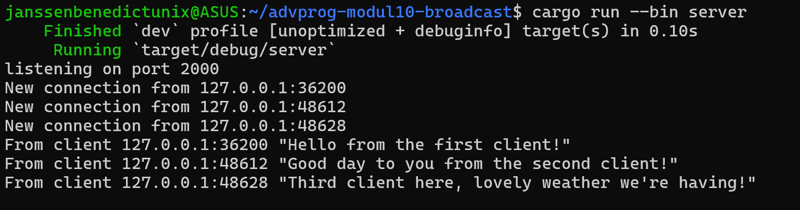

- Name: Janssen Benedict
- Class: Pemrograman Lanjut A
- NPM: 2306152102

### Experiment 2.1:

  After running the server along with three of the clients and typing something in each client, it can be seen that the server functions as a listener that manages incoming connections from all clients. The server receives messages from each of the clients when they send them, and then they proceed to broadcast those messages to the other connected clients. This allows each client to send messages to other clients but also to receive messages sent by any other connected client in real time.
- Server:

- Client 1:

- Client 2:

- Client 3:

### Experiment 2.2:

  After modifying the port to 8080 in the client.rs file, I attempted to run both the client and the server. Due to the port specified in the server.rs file remaining unchanged, the client couldn't locate the server with the appropriate port. Thus, an error message would display to indicate the failed connection attempt. The same error message would also pop up had I changed the port on the server.rs file, but not on the client.rs file.
- Server (unchanged):

- Client (changed):

After properly modifying the port to 8080 on both the client.rs and the server.rs files, I attempted to run the server and three clients. Now that both the client and the server are configured to utilize the same port, the clients were able to successfully establish a connection to the server.
- Server (at port 8080):

- Client 1 (at port 8080):

- Client 2 (at port 8080):

- Client 3 (at port 8080):
